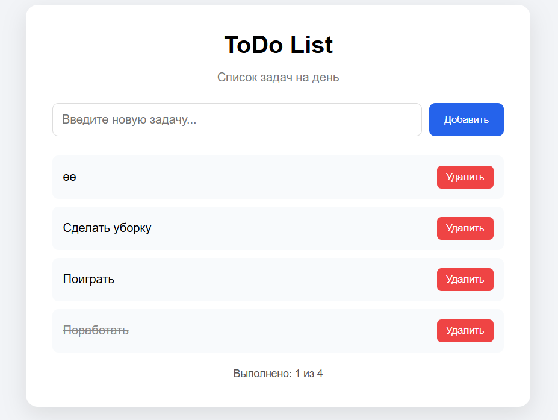

# React ToDo List — Docker

Простое React-приложение для создания и управления списком задач.

## Возможности

* добавление новых задач;
* отметка задач как выполненных;
* удаление задач;
* отображение количества выполненных задач;
* запуск приложения в Docker-контейнере.

## Используемые технологии

* React
* JavaScript
* Node.js
* Docker
* Nginx

## Запуск без Docker

Установить зависимости:

```bash
npm install
```

Запустить приложение:

```bash
npm start
```

После запуска приложение доступно по адресу:

```text
http://localhost:3000
```

## Сборка Docker-образа

Для создания Docker-образа необходимо выполнить:

```bash
docker build -t react-todo .
```

## Запуск Docker-контейнера

Запустить контейнер:

```bash
docker run -p 8080:80 react-todo
```

После запуска приложение доступно по адресу:

```text
http://localhost:8080
```

## Архитектура Docker

Проект использует многоступенчатую сборку Docker-образа.

На первом этапе используется `node:alpine`. Устанавливаются зависимости проекта и выполняется production-сборка React-приложения с помощью команды:

```bash
npm run build
```

На втором этапе используется `nginx:alpine`. Собранные статические файлы React-приложения копируются в:

```text
/usr/share/nginx/html
```

После этого Nginx запускает приложение на 80 порту контейнера.

## Скриншот приложения


